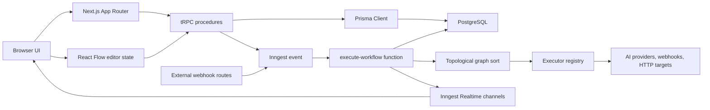
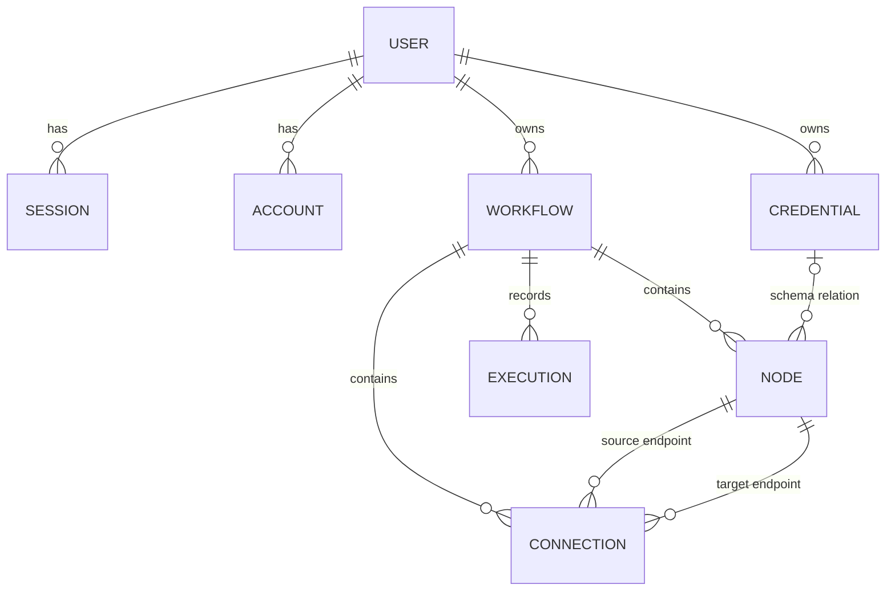

<div align="center">
  
  <h1>Automativ</h1>
  <p><strong>A visual workflow automation application built with Next.js, React Flow, and Inngest.</strong></p>

  <p>
    <a href="https://automativ.vercel.app"></a>
    <a href="https://automativ.vercel.app/learnings"></a>
  </p>

  <p><em>Build directed workflow graphs in a browser canvas, configure trigger and action nodes, save provider credentials, and run workflows through a durable background worker.</em></p>
</div>

<br />

> [!NOTE]
> This repository is the source of truth for the product as it exists today. The sibling `nodebase-main` repository is historical reference material only. It can explain where some early patterns came from, but it should not override current Automativ behavior, route structure, data shape, or product decisions.

<br />

## 📖 Table of Contents

- [Product scope](#-product-scope)
- [Feature inventory](#-feature-inventory)
- [Architecture at a glance](#-architecture-at-a-glance)
- [How a workflow is built](#-how-a-workflow-is-built)
- [How a workflow runs](#-how-a-workflow-runs)
- [Node catalog](#-node-catalog)
- [Data model](#-data-model)
- [Credentials and secrets](#-credentials-and-secrets)
- [Authentication, billing, and authorization](#-authentication-billing-and-authorization)
- [Realtime status and execution history](#-realtime-status-and-execution-history)
- [External trigger behavior](#-external-trigger-behavior)
- [Local development](#-local-development)
- [Environment variables](#-environment-variables)
- [Deployment notes](#-deployment-notes)
- [Security notes](#-security-notes)
- [Maintenance notes](#-maintenance-notes)
- [Repository map](#-repository-map)
- [Verification](#-verification)

---

## 🎯 Product scope

Automativ is currently an authenticated workflow builder with paid creation gates, encrypted user-owned AI credentials, external trigger endpoints, and a small catalog of executable nodes. It is not a general-purpose integration platform yet. 

The current execution engine is intentionally simple: it loads the latest saved graph, sorts it topologically, runs one node at a time, and carries a single accumulated context object through the workflow.

### The Practical User Journey

1. Sign up or sign in through Better Auth.
2. Create provider credentials for OpenAI, Anthropic, or Gemini.
3. Create a workflow, which starts with an `INITIAL` placeholder node.
4. Replace the placeholder with a trigger node.
5. Add action nodes and connect them in React Flow.
6. Configure each node through its dialog.
7. Save the graph.
8. Execute manually from the editor, or call one of the public webhook routes.
9. Watch transient node status in the editor.
10. Review the aggregate execution record after completion or failure.

> [!TIP]
> There are no committed product screenshots. The `public/` directory contains logos and provider assets, not UI captures.

---

## ⚡ Feature inventory

### ✅ Implemented capabilities

- **Authentication**: Email/password, GitHub, and Google authentication
- **UI Shell**: Dashboard route shell for workflow, credential, and execution lists
- **Editor**: Full-screen React Flow workflow editor
- **Workflow Management**: Creation, listing, search, pagination, detail load, update, delete, and manual execute
- **Credentials**: Creation, listing, detail load, update, and delete for supported AI provider key types
- **Execution Tracking**: Execution list and execution detail views
- **Triggers**: Manual, Google Form, and Stripe trigger nodes
- **Actions**: HTTP request, Slack, Discord, OpenAI, Anthropic, and Gemini action nodes
- **Templating**: Handlebars templating against prior workflow context
- **Orchestration**: Inngest-backed durable execution
- **Realtime Updates**: Inngest Realtime node-status messages while the editor is open
- **Billing**: Polar checkout, portal access, customer state hooks, and premium procedure gates for creation paths
- **Observability**: Sentry client, server, edge, replay, trace, and AI telemetry configuration

### 🚧 Important absences

- No automated test suite is present.
- No immutable workflow snapshot is stored per execution.
- No per-node execution output table exists.
- No autosave or editor conflict detection exists.
- No webhook signature or replay protection exists for public trigger routes.
- No SSRF protection exists for arbitrary HTTP request nodes.
- No credential key rotation workflow exists.
- No compile-time registry completeness check ensures every node type has every UI, executor, channel, and selector registration.

---

## 🏗 Architecture at a glance



The application is organized by product feature under `src/features`. Route files in `src/app` are intentionally thin: they authenticate, load URL params, prefetch tRPC queries, compose layouts, or adapt HTTP requests. Feature folders own their UI components, hooks, server procedures, parameter loaders, and prefetch helpers.

### Core Infrastructure

| Domain | Location | Description |
|--------|----------|-------------|
| **Database/Auth** | `src/lib/` | Database, auth, encryption, billing, and utilities |
| **API** | `src/trpc/` | Typed API setup, router composition, and query clients |
| **Execution** | `src/inngest/` | Background execution, realtime channels, and graph utilities |
| **Registries** | `src/config/` | Cross-feature registries such as node components |
| **Schema** | `prisma/` | Schema and migration history |

### 📚 Deeper reference documents

- **[docs/ARCHITECTURE.md](docs/ARCHITECTURE.md)**: Maps subsystems, data flow, state boundaries, database relationships, and external boundaries.
- **[docs/ONBOARDING.md](docs/ONBOARDING.md)**: The first-hour guide for a new maintainer.
- **[PROJECT_MEMORY.md](PROJECT_MEMORY.md)**: Records rationale, historical context, hidden assumptions, and the relationship to `nodebase-main`.
- **[docs/REPOSITORY_HEALTH.md](docs/REPOSITORY_HEALTH.md)**: Records security findings, technical debt, tooling status, and remaining risks.

---

## 🛠 How a workflow is built

Workflow editing crosses three representations:

| Layer | Shape | Owner |
|-------|-------|-------|
| **Browser** | React Flow `nodes` and `edges` | `src/features/editor/components/editor.tsx` |
| **API input** | Zod-validated graph payload | `src/features/workflows/server/routers.ts` |
| **Database** | `Workflow`, `Node`, and `Connection` | `prisma/schema.prisma` |

The editor loads a workflow through `workflows.getOne`, which transforms database rows into React Flow objects. Node dialogs mutate serializable configuration under each React Flow node's `data` object. The graph is not autosaved; until the user saves, React Flow local state is the only source for canvas changes.

### The Save Transaction

The save path uses a replace-all transaction:
1. Verify the workflow belongs to the authenticated user.
2. Delete existing nodes for that workflow, which cascade-deletes connections.
3. Recreate all submitted nodes using the client-supplied React Flow IDs.
4. Recreate all submitted connections using those node IDs.
5. Update the workflow timestamp.

> [!WARNING]
> This design is easy to reason about and avoids half-saved graphs, but it has clear consequences:
> - Node IDs are part of the persistence contract.
> - Last writer wins when two editors save the same workflow.
> - Partial graph update semantics do not exist.
> - Deleting a credential referenced inside `Node.data` is not repaired by the schema-level `Node.credentialId` relation.
> - Cycles are currently rejected during execution, not during editing or saving.

---

## ⚙️ How a workflow runs

Manual execution starts in the editor header. External execution starts through the Google Form or Stripe webhook route. Both eventually send the same Inngest event type: `workflows/execute.workflow`.

### Execution Flow

1. The execute button saves the current React Flow graph before enqueueing.
2. `workflows.execute` verifies workflow ownership.
3. `sendWorkflowExecution` emits an Inngest event with `workflowId` and optional `initialData`.
4. `executeWorkflow` creates an `Execution` row in `RUNNING` state, correlated by the Inngest event ID.
5. The worker loads the current workflow graph from PostgreSQL.
6. `topologicalSort` orders nodes and rejects cycles.
7. `getExecutor` resolves the persisted `NodeType` to a server executor.
8. Each executor receives the current context and returns the next complete context.
9. Executors publish transient node-status messages through Inngest Realtime.
10. Success stores final context and `completedAt`; failure stores error details through the Inngest `onFailure` handler.

Execution records are aggregate records. They do not contain the graph version that ran, every node output, or every intermediate state. When debugging a run, inspect three different systems separately: Inngest step/run state, the durable `Execution` row, and transient browser node-status state.

---

## 📦 Node catalog

| Node type | Role | Main files | Notes |
|-----------|------|------------|-------|
| `INITIAL` | Placeholder | `manual-trigger/executor.ts`, workflow creation procedure | Created with new workflows, then replaced by the first real node. |
| `MANUAL_TRIGGER` | Trigger | `features/triggers/components/manual-trigger` | No-op trigger for editor-initiated runs. |
| `GOOGLE_FORM_TRIGGER` | Trigger | `features/triggers/components/google-form-trigger`, webhook route | Seeds context from arbitrary posted form JSON. |
| `STRIPE_TRIGGER` | Trigger | `features/triggers/components/stripe-trigger`, webhook route | Seeds context from arbitrary posted Stripe-like JSON. |
| `HTTP_REQUEST` | Action | `features/executions/components/http-request` | Uses Handlebars templates and `ky` for outbound requests. |
| `SLACK` | Action | `features/executions/components/slack` | Posts configured payloads to a stored webhook URL. |
| `DISCORD` | Action | `features/executions/components/discord` | Posts configured payloads to a stored webhook URL. |
| `OPENAI` | Action | `features/executions/components/openai` | Uses encrypted user credentials and a fixed model in executor code. |
| `ANTHROPIC` | Action | `features/executions/components/anthropic` | Uses encrypted user credentials and a fixed model in executor code. |
| `GEMINI` | Action | `features/executions/components/gemini` | Chooses from weighted model candidates in `model-selector.ts`. |

Adding or changing a node means touching multiple registries and contracts:
- `NodeType` in `prisma/schema.prisma`
- Node component files under `src/features`
- `src/config/node-components.ts`
- `src/components/node-selector.tsx`
- `src/features/executions/lib/executor-registry.ts`
- Realtime channel files under `src/inngest/channels`
- Channel registration in `src/inngest/functions.ts`
- Server actions that mint realtime subscription tokens

> [!IMPORTANT]
> A partial registration can still compile and fail only at runtime. Use the full checklist in [docs/ONBOARDING.md](docs/ONBOARDING.md#add-a-node).

---

## 📊 Data model



### Primary Persistence Rules

- Users own workflows and credentials.
- Workflows own nodes, connections, and executions.
- Deleting a workflow cascades to its graph and execution history.
- Deleting a node cascades any connection where it is the source or target.
- Connection endpoint tuples are unique.
- Execution rows are correlated to Inngest events through a unique `inngestEventId`.
- AI credential IDs are commonly stored inside `Node.data`; the schema-level `Node.credentialId` relation is not populated by the current graph save.

The workflow context passed between nodes is a flat object. Executors are expected to merge previous context and add their own named output:

```ts
{
  ...context,
  [variableName]: {
    text: resultText,
  },
}
```

If an executor returns only its own output, every upstream value disappears. If two nodes write the same variable name, the later node overwrites the earlier value. This is a product behavior, not a TypeScript-enforced contract.

---

## 🔑 Credentials and secrets

Provider credentials are stored in the `Credential` table. The secret value is encrypted with `Cryptr` and `ENCRYPTION_KEY` before persistence. Executors query credentials by both `credentialId` and `userId`, decrypt only on the server, and construct provider clients immediately before use.

Credential handling is better than plaintext storage, but it is not a complete secret-management system:

- Credential queries currently return encrypted values to authenticated clients.
- Editing an unchanged encrypted value can encrypt ciphertext again.
- `ENCRYPTION_KEY` is not versioned.
- Key rotation and recovery tooling do not exist.
- Slack and Discord webhook URLs live in node JSON rather than the credential system.
- Workflow context, execution output, errors, and telemetry can contain integration data if a node writes it there.

> [!CAUTION]
> Plaintext provider keys should not be placed in node data, execution context, logs, browser responses, or Sentry events.

---

## 🔐 Authentication, billing, and authorization

Better Auth owns application identity. It persists users, sessions, accounts, and verification records in PostgreSQL. Authenticated route helpers protect page routes; tRPC `protectedProcedure` protects resource procedures.

Authorization is enforced in Prisma predicates. The important pattern is:

```ts
where: {
  id,
  userId: ctx.auth.user.id,
}
```

For nested resources, execution queries traverse through the owning workflow. The client should never be trusted to supply a user ID.

Polar is integrated through Better Auth and the Polar SDK. Current product policy is:
- **Workflow creation**: Requires an active premium state
- **Credential creation**: Requires an active premium state
- **Existing resources**: Reading, updating, deleting, and executing existing owned resources require authentication and ownership, but not an active subscription.

That distinction matters. Widening premium gates changes product behavior, not just implementation detail. `src/lib/polar.ts` currently targets the Polar sandbox server, so production deployment needs an explicit billing environment review.

---

## 📡 Realtime status and execution history

Automativ has two separate concepts that can look similar from the UI:

| System | Lifetime | Purpose |
|--------|----------|---------|
| **Inngest Realtime** | Transient browser state | Show node loading/success/error while editing. |
| **`Execution` table** | Durable database record | Store aggregate run status, output, and error. |

Realtime channels are provider-wide and the browser filters messages by node ID. They are not scoped to user, workflow, or execution. Reloading the editor loses node status, and running the same workflow twice can produce ambiguous UI if node IDs overlap and status is not correlated to a specific execution.

The execution table records:
- `RUNNING`, `SUCCESS`, or `FAILED`
- Start and completion timestamps
- Final context output on success
- Error and stack on failure
- Inngest event correlation ID

It does not record every node's status or output over time.

---

## 🔌 External trigger behavior

The public routes are:
- `/api/webhooks/google-form?workflowId=...`
- `/api/webhooks/stripe?workflowId=...`

Both routes parse JSON and enqueue the referenced workflow. They currently do not verify signatures, generated trigger secrets, sender identity, event age, or replay keys. Possession of a workflow ID is enough to trigger execution.

> [!WARNING]
> Treat these routes as development or internal integration surfaces until an authenticity layer exists. In production, they can trigger cost-bearing AI work, send Slack/Discord messages, call arbitrary HTTP targets, and persist attacker-controlled context.

---

## 💻 Local development

### Prerequisites

- Node.js 20 or another compatible current LTS release
- npm
- Docker, or another PostgreSQL instance
- ngrok CLI if using the combined `npm run dev` command or testing public trigger callbacks

### Initial setup

```bash
npm install
docker compose up -d
copy .env.example .env
npx prisma migrate dev
npm run dev
```

The combined `npm run dev` command runs three processes through `concurrently`:
- `next dev --turbopack`
- `inngest-cli dev`
- `ngrok http --url=$NGROK_URL 3000`

For UI work that does not need a public tunnel, run the long-lived processes separately:

```bash
npx next dev --turbopack
npm run inngest:dev
```

### Common Local URLs and Behavior

| URL | Description |
|-----|-------------|
| `/` | Redirects to `/workflows` |
| `/workflows` | Dashboard workflow list |
| `/workflows/[workflowId]` | Full-screen editor |
| `/credentials` | Manages provider keys |
| `/executions` | Shows execution history |
| `/learnings` | Shows an in-app engineering knowledge page |
| `/api/inngest` | Exposes registered Inngest functions |

If an execution remains `RUNNING`, first confirm both Next.js and the Inngest dev server are active. The web app can enqueue events even when no worker is available to process them.

---

## 📝 Environment variables

Start from `.env.example`. Do not commit `.env` or `.env.sentry-build-plugin`.

| Group | Variables | Required for |
|-------|-----------|--------------|
| **Database** | `DATABASE_URL` | Prisma and every persisted feature |
| **Better Auth** | `BETTER_AUTH_SECRET`, `BETTER_AUTH_URL` | Sessions and auth routes |
| **OAuth** | GitHub and Google client IDs/secrets | Social sign-in buttons |
| **App URLs** | `NEXT_PUBLIC_APP_URL`, `NGROK_URL` | Trusted origins, webhooks, combined dev command |
| **Encryption** | `ENCRYPTION_KEY` | Credential create/read/use |
| **Polar** | Access token, product ID, success URL, server setting | Checkout, portal, premium gates |
| **Sentry** | DSN, auth token, org, project | Runtime telemetry and source-map upload |
| **Provider Demos** | Root OpenAI, Anthropic, and Gemini keys | Optional model-list diagnostic scripts only |

The workflow execution path does not use root-level provider environment keys. AI nodes use user-owned encrypted credentials from the database. The root `*ModelAccess.js` files are manual diagnostic scripts, not the execution path.

Many integration variables are currently asserted where they are used rather than validated once on startup. Missing configuration may fail during import, first render, first mutation, or first background run depending on which module uses the variable.

---

## 🚀 Deployment notes

Deployment requires more than a successful Next.js build:

1. Provision PostgreSQL.
2. Set all production environment variables.
3. Run `npx prisma migrate deploy` during release.
4. Build with `npm run build`.
5. Start with `npm start`, or deploy to a compatible Next.js host.
6. Register `/api/inngest` with the production Inngest environment and configure required event/signing credentials.
7. Configure Better Auth trusted origins and OAuth callback URLs.
8. Configure Polar products, checkout, customer portal, and production server selection.
9. Decide whether public trigger routes are allowed before exposing them.
10. Review Sentry replay, tracing, AI telemetry, PII scrubbing, and source-map upload.
11. Verify that external HTTP, Slack, Discord, and AI side effects are acceptable from the deployment network.

---

## 🛡️ Security notes

High-priority concerns documented during the stewardship pass:

- Google Form and Stripe trigger routes do not verify authenticity or prevent replay.
- HTTP nodes can call arbitrary URLs from the server runtime.
- Realtime channels are provider-wide and filtered by node ID in the browser.
- Credential query/edit behavior exposes ciphertext and can double-encrypt an unchanged value.
- Slack and Discord webhook URLs are stored in workflow node JSON.
- Execution output, prompts, provider responses, errors, stacks, and Sentry telemetry can contain sensitive data.
- `ENCRYPTION_KEY` loss makes stored provider credentials unrecoverable.

Security-sensitive work should begin with [docs/REPOSITORY_HEALTH.md](docs/REPOSITORY_HEALTH.md), then trace the exact route or executor being changed.

---

## 🛠️ Maintenance notes

Use these rules when changing the repository:

- Keep Automativ behavior authoritative over `nodebase-main`.
- Preserve user ownership checks in database predicates.
- Treat React Flow node IDs as persisted graph identifiers.
- Save before enqueueing execution.
- Return the complete next context from every executor.
- Use node-specific Inngest step IDs for side effects that may repeat.
- Keep plaintext secrets server-side and out of context/logging paths.
- Do not rewrite historical Prisma migrations after deployment.
- Keep provider model names, UI copy, and executor code synchronized.
- Treat public webhooks, arbitrary HTTP, and observability as security boundaries.

The current implementation favors explicit provider modules over a premature generic provider framework. That repetition is not accidental. Extract shared AI or messaging helpers only when it removes concrete duplication without hiding provider-specific behavior.

---

## 🗺️ Repository map

```text
prisma/                       schema and migration history
public/                       product logos, icons, and provider assets
src/app/                      route groups, pages, layouts, API handlers
src/components/               shared app shell, node selector, generated UI
src/config/                   node-component and pagination registries
src/features/auth/            login and registration UI
src/features/credentials/     credential UI, hooks, params, and procedures
src/features/editor/          React Flow canvas, editor header, execute button
src/features/executions/      action nodes, executors, status hooks, history
src/features/subscriptions/   Polar customer-state hooks
src/features/triggers/        trigger nodes and trigger executors
src/features/workflows/       workflow UI, hooks, params, procedures
src/inngest/                  client, background function, channels, graph utils
src/lib/                      auth, database, encryption, billing, utilities
src/trpc/                     API initialization, routers, query clients
docs/                         architecture, onboarding, and health records
```

### Notable root files

- `docker-compose.yaml`: starts local PostgreSQL.
- `biome.json`: configures formatting/linting.
- `components.json`: configures shadcn/ui generation.
- `next.config.ts`: configures Next.js and Sentry integration.
- `.env.example`: is the sanitized environment inventory.

---

## ✅ Verification

Use these commands before handing off meaningful changes:

```bash
npx tsc --noEmit
npm run lint
npm run build
```

Current stewardship baseline:
- `npx tsc --noEmit` passes.
- `npm run build` passes, with existing warnings from optional OpenTelemetry Winston transport resolution and Handlebars `require.extensions` usage in the bundled executor graph.
- `npm run lint` is not clean at repository baseline. Biome reports a schema/CLI mismatch, CRLF formatting churn, public SVG findings, and existing source lint issues.
- No automated test script or test files are present.

> [!NOTE]
> Do not treat the noisy lint baseline as permission to add more noise. For targeted changes, run TypeScript and any focused formatter/lint command that keeps the touched files clean without mass-formatting unrelated files.
