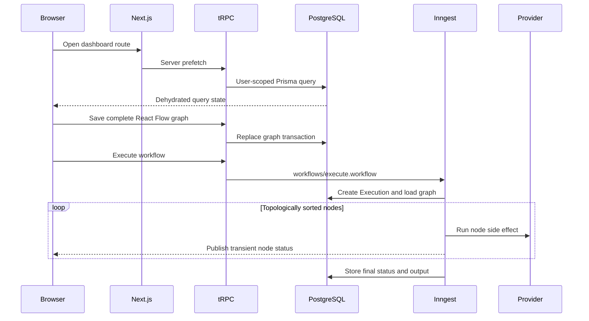

# Automativ architecture inventory

This document maps the current implementation. It describes what exists, where execution enters each subsystem, and what future maintainers need to preserve. `PROJECT_MEMORY.md` covers rationale and historical context; `REPOSITORY_HEALTH.md` covers risks.

## Request and data flow



## Subsystem inventory

| Subsystem           | Purpose                                                         | Entry points                                                        | Main dependencies                         | Maintenance notes                                                                                                        |
| ------------------- | --------------------------------------------------------------- | ------------------------------------------------------------------- | ----------------------------------------- | ------------------------------------------------------------------------------------------------------------------------ |
| App routing         | Compose public, auth, dashboard, list, and editor layouts       | `src/app/layout.tsx`, route groups under `src/app/(dashboard)`      | Next.js App Router                        | `(rest)` adds the header; `(editor)` keeps the workflow canvas full screen.                                              |
| Authentication      | Sessions, password login, GitHub/Google OAuth                   | `src/lib/auth.ts`, `/api/auth/[...all]`                             | Better Auth, Prisma, Polar plugin         | Server pages call `requireAuth`; APIs use `protectedProcedure`. `auth.ts` owns a separate Prisma client.                 |
| Authorization       | Enforce user ownership and paid creation                        | `src/trpc/init.ts`, feature routers                                 | Better Auth session, Polar customer state | Resource procedures generally include `userId` in Prisma filters. `premiumProcedure` makes a remote Polar state request. |
| Workflow management | CRUD, naming, list filters, graph persistence                   | `src/features/workflows/server/routers.ts`                          | Prisma, Zod, tRPC, unique-names-generator | Create is premium; read/update/delete/execute require auth and ownership. Save replaces the whole graph transactionally. |
| Editor              | Display and mutate the in-memory graph                          | `src/features/editor/components/editor.tsx`                         | React Flow, Jotai                         | React Flow owns nodes/edges. Jotai stores only the editor instance so header/buttons can read it.                        |
| Node catalog        | Make node types available to UI and execution                   | `src/config/node-components.ts`, `src/components/node-selector.tsx` | Prisma `NodeType`, React Flow             | Adding a type requires coordinated UI, schema, executor, channel, and registry updates.                                  |
| Workflow execution  | Create and finish execution records, order nodes, carry context | `src/inngest/functions.ts`, `src/inngest/utils.ts`                  | Inngest, Prisma, toposort                 | Nodes run sequentially. The graph is loaded after enqueue and is not snapshotted on the execution.                       |
| Executor registry   | Route persisted node types to server code                       | `src/features/executions/lib/executor-registry.ts`                  | `NodeExecutor` contract                   | `INITIAL` maps to the manual no-op executor. Missing registrations fail only at runtime.                                 |
| Trigger nodes       | Seed or pass through initial context                            | `src/features/triggers`, webhook routes                             | Inngest, Next.js handlers                 | Manual trigger has no data. Google Form and Stripe routes build named initial context objects.                           |
| Action nodes        | Perform HTTP, message, and AI operations                        | `src/features/executions/components/*/executor.ts`                  | ky, Handlebars, AI SDK                    | Each action returns a new context. Variable-name collisions overwrite earlier values.                                    |
| AI providers        | Generate text using user credentials                            | OpenAI, Anthropic, Gemini executor directories                      | Vercel AI SDK provider packages           | Shared executor shape, duplicated provider modules. Models are selected in server code, not user configuration.          |
| Credentials         | Store provider keys and select them in AI nodes                 | `src/features/credentials`, `src/lib/encryption.ts`                 | Prisma, Cryptr                            | Ciphertext is user-owned; executors re-check ownership. Node JSON stores the selected credential ID.                     |
| Execution history   | Query aggregate run status and outputs                          | `src/features/executions/server/routers.ts`                         | Prisma, tRPC                              | Queries traverse `Execution.workflow.userId`. No per-step table exists.                                                  |
| Realtime status     | Show transient per-node progress                                | `src/inngest/channels`, `use-node-status.ts`, node server actions   | Inngest Realtime                          | Channels are provider-wide. UI filters by node ID; status resets on reload.                                              |
| Billing             | Create customers, checkout, portal, and gate creation           | `src/lib/polar.ts`, `src/lib/auth.ts`, subscription hooks           | Polar                                     | SDK client is hardcoded to sandbox. Workflow and credential creation are premium-only.                                   |
| API/cache layer     | Typed procedures and client hydration                           | `src/trpc`, feature prefetch modules                                | tRPC, TanStack Query, SuperJSON           | Query clients use a 30-second stale time. Server query clients are request-cached; browser client is a singleton.        |
| URL state           | Persist list filters in navigation state                        | feature `params.ts`, loaders, hooks                                 | nuqs                                      | Search/pagination are shareable and survive browser navigation.                                                          |
| Database            | Persist identity, graphs, credentials, and executions           | `prisma/schema.prisma`, `src/lib/db.ts`                             | Prisma, PostgreSQL                        | Migrations are authoritative. Generated client lives under ignored `src/generated/prisma`.                               |
| Observability       | Capture errors, traces, replay, and AI calls                    | Sentry config and instrumentation files                             | Sentry, AI SDK telemetry                  | AI inputs/outputs and replay may contain user data. Sampling is currently broad.                                         |

## Folder and feature boundaries

- `src/app` should stay thin: route composition, authentication guards, parameter loading, prefetch, and HTTP adapters.
- `src/features/<feature>/server` owns tRPC procedures and prefetch helpers.
- `src/features/<feature>/hooks` owns browser query/mutation adapters and cache invalidation.
- `src/features/executions/components/<node>` and `src/features/triggers/components/<node>` co-locate a node's renderer, settings dialog, token action, and executor.
- `src/components/ui` is generated/general UI infrastructure. Product behavior should normally live outside it.
- `src/inngest` owns orchestration and transport, while node-specific side effects stay in executors.
- `src/lib` contains process-wide integrations that do not belong to one product feature.

## Graph persistence

The editor and database deliberately use different shapes:

| React Flow            | Prisma                   |
| --------------------- | ------------------------ |
| `Node.position`       | `Node.position` JSON     |
| `Node.data`           | `Node.data` JSON         |
| `Edge.source`         | `Connection.fromNodeId`  |
| `Edge.target`         | `Connection.toNodeId`    |
| source/target handles | `fromOutput` / `toInput` |

`workflows.getOne` translates persisted rows into editor objects. `workflows.update` validates the editor shape, checks workflow ownership, deletes existing nodes (which cascade-deletes connections), recreates nodes with their client-supplied IDs, then recreates connections. The transaction prevents a half-written graph.

The editor is not autosaved. The execute button explicitly saves before enqueueing. Navigating away with unsaved changes discards those changes.

## Execution engine

`sendWorkflowExecution` assigns an event ID. The Inngest function uses that ID as the unique execution correlation key.

`topologicalSort` creates directed edges from persisted connections. Disconnected nodes receive self-edges solely so the library includes them; duplicate IDs are removed afterward. Cycles raise an execution error. Ordering between disconnected branches is not a stable business contract.

The execution context is a flat `Record<string, unknown>`:

```ts
{
  googleForm?: { /* trigger payload */ },
  stripe?: { /* trigger payload */ },
  chosenVariable: { text: "..." },
  requestResult: { httpResponse: { /* ... */ } }
}
```

Action configuration can reference prior context through Handlebars expressions. A registered `json` helper renders an object as formatted JSON. HTTP URL/body templates disable Handlebars HTML escaping so query parameters and JSON remain valid; AI and message templates decode or compile according to their executor.

Each executor should use a node-specific Inngest step ID. The HTTP executor already includes `nodeId`; several provider/message executors still use static step names, which deserves care when workflows contain repeated node types.

## AI provider implementation

Provider flow:

1. Dialog stores `credentialId`, variable name, system prompt, and user prompt in node `data`.
2. Executor validates required configuration and compiles prompts against accumulated context.
3. Prisma queries the credential by both ID and workflow owner ID.
4. The key is decrypted server-side.
5. The provider-specific AI SDK client executes inside `step.ai.wrap`.
6. Text output is stored at `context[variableName].text`.

Telemetry currently records AI inputs and outputs. OpenAI uses `gpt-5.4-mini`; Anthropic uses `claude-haiku-4-5`; Gemini makes a weighted choice in `model-selector.ts`. These names are operational configuration embedded in code and can become stale independently of the UI help text and root diagnostic scripts.

## Authentication, authorization, and billing

Better Auth persists users, sessions, accounts, and verification records in the same PostgreSQL database. Authenticated page routes redirect through helpers in `auth-utils.ts`. tRPC does not trust a client-supplied user ID; `protectedProcedure` resolves the session from request headers.

`premiumProcedure` extends the authenticated context after querying Polar by the Better Auth user ID. It gates workflow creation and credential creation. Existing resources remain readable and mutable through protected procedures even when a subscription is inactive. That distinction is current behavior and should be changed only as a deliberate product policy.

## Caching and state

- TanStack Query caches server data with a default 30-second stale time.
- Server Components prefetch queries and dehydrate pending/successful states through SuperJSON.
- Mutations invalidate feature list/detail keys rather than maintaining a second normalized client store.
- nuqs stores search, page, page size, and execution workflow filters in the URL.
- React Flow local component state is the authoritative unsaved graph.
- Jotai exposes the current React Flow instance to sibling editor controls.
- Realtime status is component state derived from incoming Inngest messages; it is neither cached nor persisted.

## Database relationships and deletion behavior

- Deleting a user cascades to sessions, accounts, workflows, and credentials.
- Deleting a workflow cascades to nodes, connections, and executions.
- Deleting a node cascades connections where it is either endpoint.
- Deleting a credential sets a schema-level `Node.credentialId` reference to null, but IDs embedded in node JSON are not automatically repaired.
- Connection endpoint/handle tuples are unique. Query indexes cover owner/date list paths and execution status/history paths.

## External boundaries

- `/api/trpc/[trpc]` is the typed application API.
- `/api/auth/[...all]` exposes Better Auth handlers.
- `/api/inngest` exposes the registered background functions.
- `/api/webhooks/google-form` and `/api/webhooks/stripe` enqueue external runs.
- AI provider APIs receive prompts and credentials.
- arbitrary HTTP, Slack, and Discord destinations receive user-authored payloads.
- Polar receives customer and checkout requests.
- Sentry receives errors, traces, replay, logs, and AI telemetry.

Each boundary should be reviewed when changing data classification, tenancy, logging, or retry behavior.
